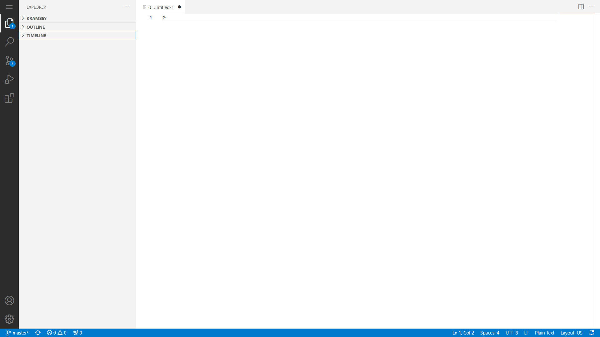

# Batch Connect - OSC Code Server


[](https://opensource.org/licenses/MIT)

## Overview

An [Open OnDemand](https://openondemand.org/) Batch Connect app that launches
[Code Server](https://coder.com/) as an interactive web-based session on OSC
HPC clusters. Code Server provides a full
[VS Code](https://code.visualstudio.com/) editing experience running on a
compute node and accessible through a browser.

This app uses the Batch Connect `basic` template with Slurm and supports
clusters: Ascend and Pitzer.

- **Upstream project:** [Code Server](https://coder.com/) / [VS Code](https://code.visualstudio.com/)
- **Batch Connect template:** `basic`
- **Scheduler:** Slurm

## Screenshots



## Features

- Full VS Code editor experience in the browser via Code Server
- Multi-cluster support (Ascend, Pitzer)
- Working directory selector for the Code Server session
- Dynamic Code Server module selection via `auto_modules_app_code_server`
- Password-authenticated sessions
- C/C++ extension support with IntelliSense database on local filesystem
- Telemetry disabled by default
- Module-based software loading via Lmod (`project/ondemand`, `app_code_server/`)

## Requirements

### Compute Node Software

This Batch Connect app requires the following software be installed on the
**compute nodes** that the batch job is intended to run on (**NOT** the
OnDemand node):

- [Lmod](https://www.tacc.utexas.edu/research-development/tacc-projects/lmod)
  6.0.1+ or any other `module purge` and `module load <modules>` based CLI
  used to load appropriate environments within the batch job before launching
  Code Server
- [Code Server](https://coder.com/) 2.x+ available from GitHub:
  https://github.com/coder/code-server/releases

### Open OnDemand

- Open OnDemand 2.0+
- Slurm scheduler

## App Installation

### 1. Clone the repository

```sh
cd /var/www/ood/apps/sys
git clone https://github.com/OSC/bc_osc_codeserver.git
cd bc_osc_codeserver

# Pin to a release (recommended)
git checkout v0.13.0
```

No restart is needed -- Batch Connect apps are not Passenger apps and are
detected automatically.

### 2. Deploy Code Server binary

If you are not using the `app_code_server/` module, you can deploy the
code-server binary manually:

```sh
# Replace URL with latest release from code-server
wget https://github.com/coder/code-server/releases/download/<version>/code-server-<version>-linux-amd64.tar.gz
tar -xzf code-server-<version>-linux-amd64.tar.gz
```

### 3. Configure for your site

Edit `form.yml` and update these values for your cluster:

| Attribute                      | OSC Default          | Change to                        |
|--------------------------------|----------------------|----------------------------------|
| `cluster`                      | `ascend`, `pitzer`   | Your cluster name(s)             |
| `auto_modules_app_code_server` | (dynamic)            | Code Server module name(s) on your system |

In `script.sh.erb`, the app loads modules with:
```
module load project/ondemand app_code_server/<version>
```
Ensure equivalent modules are available on your system, or update the script
to point to your code-server binary path.

### 4. Update the app

```sh
cd /var/www/ood/apps/sys/bc_osc_codeserver
git fetch
git checkout <tag>
```

No restart is needed.

## Configuration

### form.yml attributes

| Attribute                      | Widget        | Description                                    | Default          |
|--------------------------------|---------------|------------------------------------------------|------------------|
| `cluster`                      | select        | Target cluster ID(s)                           | `ascend`, `pitzer` |
| `bc_num_hours`                 | number        | Maximum wall time (hours)                      | 1 |
| `working_dir`                  | path_selector | Working directory for the Code Server session  | `$HOME`          |
| `auto_modules_app_code_server` | select        | Code Server module version to load (auto-detected) | (dynamic) |

## Known Limitations

- In-app installation of extensions does not work
- The authentication provided by code-server is unencrypted

## Troubleshooting

<!-- TODO: Add troubleshooting tips you've encountered -->
### Connection timeout

The app may need more time to start. Increase the connection timeout or check that the compute node can open the required port.

## Testing

<!-- TODO: Update with sites where this app has been deployed -->

| Site                      | OOD Version    | Scheduler | Status     |
|---------------------------|----------------|-----------|------------|
| Ohio Supercomputer Center | 4.2.2  | Slurm     | Production |

## Contributing

1. Fork it ( https://github.com/OSC/bc_osc_codeserver/fork )
2. Create your feature branch (`git checkout -b my-new-feature`)
3. Commit your changes (`git commit -am 'Add some feature'`)
4. Push to the branch (`git push origin my-new-feature`)
5. Create a new Pull Request

For bugs or feature requests,
[open an issue](https://github.com/OSC/bc_osc_codeserver/issues).

## References

- [Code Server](https://coder.com/) -- the application launched by this app
- [VS Code](https://code.visualstudio.com/) -- the editor Code Server is based on
- [code-server GitHub releases](https://github.com/coder/code-server/releases)
  -- binary releases of Code Server
- [Open OnDemand](https://openondemand.org/) -- the HPC portal framework
- [OOD Batch Connect app development docs](https://osc.github.io/ood-documentation/latest/app-development.html)
- [Changelog](https://github.com/OSC/bc_osc_codeserver/blob/master/CHANGELOG.md)
  -- release history for this app

## License

* Documentation, website content, and logo is licensed under
  [CC-BY-4.0](https://creativecommons.org/licenses/by/4.0/)
* Code is licensed under GPL-3.0 (See LICENSE.xt)

## Acknowledgments

This app is built on [Open OnDemand](https://openondemand.org/), developed and
maintained by the [Ohio Supercomputer Center (OSC)](https://www.osc.edu/).

Open OnDemand is supported by the National Science Foundation under awards
[NSF SI2-SSE-1534949](https://www.nsf.gov/awardsearch/showAward?AWD_ID=1534949)
and [NSF CSSI-Frameworks-1835725](https://www.nsf.gov/awardsearch/showAward?AWD_ID=1835725).

